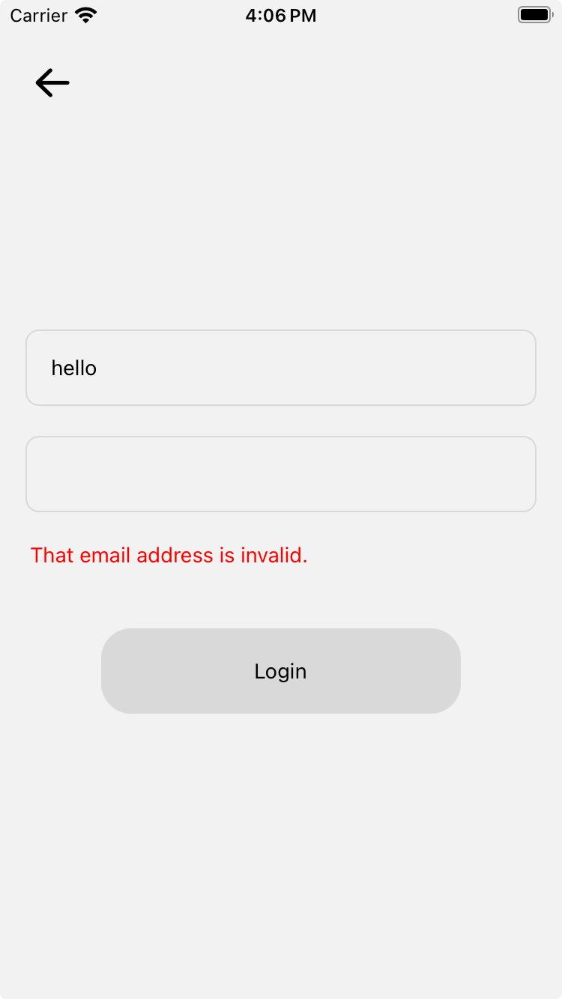
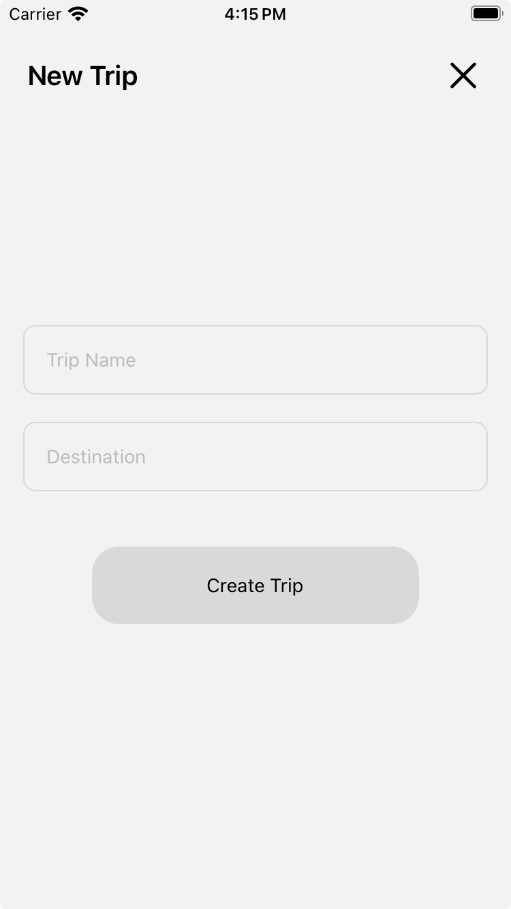

# Itinerary Generator Application (iOS)

Developer: Anthony Xu

Designer: Monica Min

**Description:** This is an AI itinerary generator iOS application powered by OpenAI's ChatGPT. Users can generate itineraries for their trips based on their preferences and saved places. 

**Tech Stack:** React Native frontend, Spring Boot backend (built with Maven), Firestore Database

**3rd Party Services**: FirebaseAuth for user authentication, OpenAI Assistants API for ChatGPT integration, Google Places API for place information

**User Flow:** 
- **Signup/Login:** A user starts by logging in or creating an account with their email/password. 
- **Trips:** After logging in hey enter a trips screen listing all of their existing trips (empty if new user). They can also create new trips, edit trips, or delete trips (CRUD). 
- **Places:** Users can also save places they want to visit into the trips, similar to saving restaurants on Yelp. These places will then be included in the generated itinerary.
- **Itinerary:** After saving places to the trip, the user can then generate the itinerary. The AI will make the itinerary and save it to the user's trip. From there, the user can edit the itinerary to their liking, or generate a new one.

**Status:**
- Basic adding trips functionality completed
- Login/Signup functionality completed including error handling

